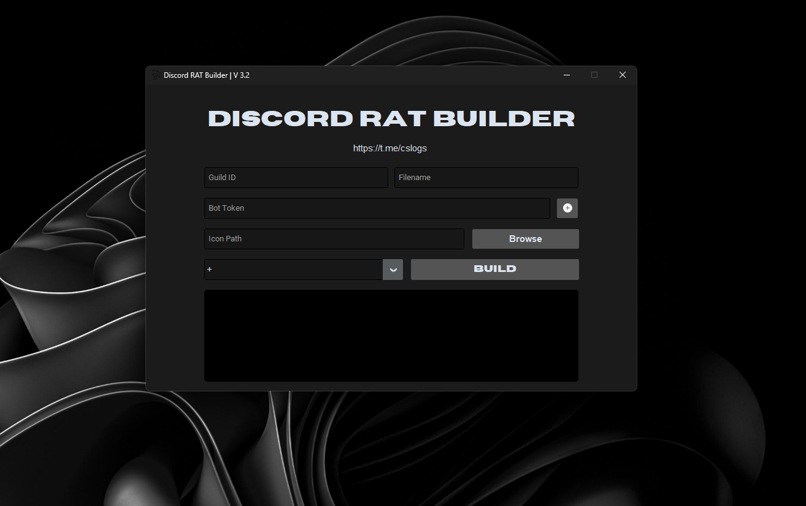
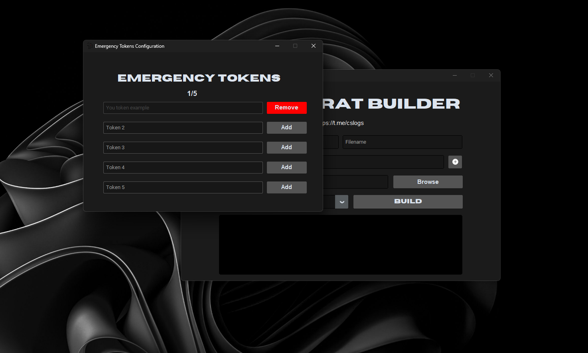

# BestDiscordRAT  
**Outil d'accès à distance via Discord — À but éducatif et préventif**

## Table des matières
- [À propos](#à-propos)
- [Fonctionnalités](#fonctionnalités)
- [Installation](#installation)
- [Utilisation](#utilisation)
- [Captures d'écran](#captures-décran)
- [Licence](#licence)
- [Avertissement](#avertissement)

## À propos
BestDiscordRAT est un outil de démonstration écrit en Python destiné à illustrer le fonctionnement d'un Remote Access Tool (RAT) utilisant Discord comme canal de commande et de contrôle.  
Il est conçu **exclusivement pour des objectifs éducatifs, défensifs et préventifs** dans des environnements contrôlés.  
Le projet vise à aider les étudiants, chercheurs et passionnés en cybersécurité à comprendre le comportement des RAT, améliorer leurs compétences en détection, et renforcer leurs stratégies défensives.

## Fonctionnalités
- Bot Discord utilisé comme Command & Control (C2)  
- Interface graphique pour la construction (`GUI.py`)  
- Builder automatique (`Builder.bat`)  
- Script d'installation rapide (`Setup.bat`)  
- Exécution de commandes à distance  
- Capture d'écran  
- Téléversement et téléchargement de fichiers  
- Récupération d'informations système  
- Architecture modulaire permettant d'ajouter ou retirer des fonctionnalités  

Et bien plus encore, voir [Captures d'écran](#captures-décran).

## Installation
Cloner le dépôt :
```bash
git clone https://github.com/NoonePYDEV/BestDiscordRAT
cd BestDiscordRAT
```

Créer et activer un environnement virtuel Python si nécessaire :
```bash
python -m venv venv
# Windows
venv\Scripts\activate
# Linux/macOS
source venv/bin/activate
```

Installer les dépendances :
```bash
pip install -r requirements.txt
```

## Utilisation
Lancer l'interface graphique (GUI) :
```bash
python GUI.py
```

Construire l'exécutable :
```bash
Builder.bat
```

Configurer votre token Discord, les IDs de channels, ainsi que les autres paramètres dans les fichiers de configuration ou directement dans le script (selon votre configuration).

## Captures d'écran


<br>



## Licence
Ce projet est publié sous la licence incluse dans le dépôt.

## ⚠️ Avertissement
L'auteur **n'est pas responsable** d'un mauvais usage ou de dommages causés par cet outil.  
Utilisez-le de manière responsable, éthique et conforme à la loi.
